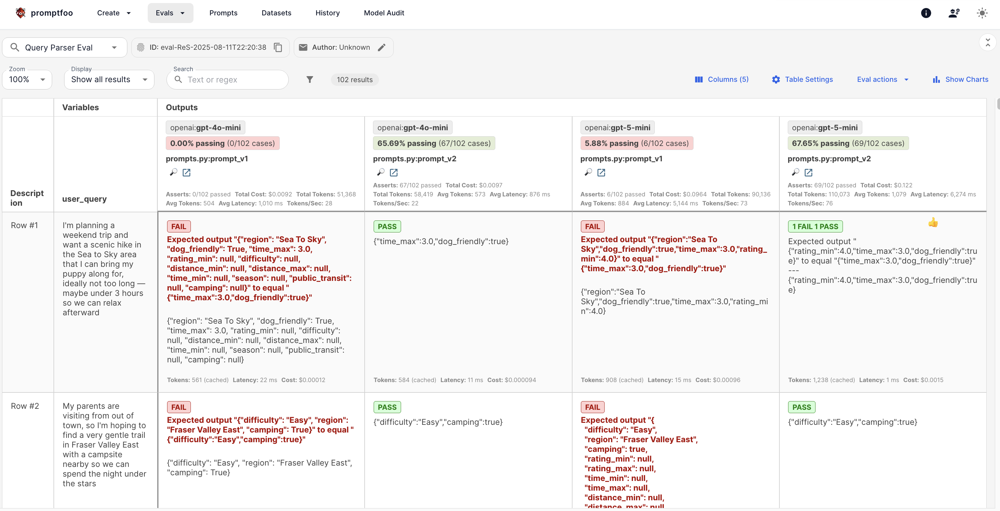

## Evaluation

I evaluated three parts of this RAG system:
- query_parser
- retrieval
- generation

### Query Parser

The [`query_parser`](../src/processing/query_parser.py) transforms natural language queries into JSON format filters that are used in the first step of [`vector_search`](../src/rag/vector_search.py).

For example, when processing a query like "Could you suggest an easy, family-friendly walk that's stroller-accessible, stretches for at least 8 km, but doesn't take more than 3 hours to complete", the `query_parser` is expected to output `{"difficulty":"Easy","time_max":3,"distance_min":8}`. This JSON is then used as a metadata filter for Qdrant vector search.

I used [Promptfoo](https://www.promptfoo.dev/), an open-source CLI and library for evaluating and red-teaming LLM applications, to evaluate different combinations of prompts and LLMs.

All tested prompts can be found in [`prompt.py`](query_parser/prompts.py), while the tested LLMs are configured in [`promptfooconfig.yaml`](query_parser/promptfooconfig.yaml).

Based on the evaluation results, `prompt_v2` combined with `GPT-5-mini` were selected to implement the `query_parser` functionality.

While the pass rate is only 67.65% (69/102), those failed cases are manually reviewed by me and turns out all the outputs are actually acceptable.



### Retrieval

In this file ([`test_retrieval.py`](retrieval/test_retrieval.py)), I tested the functionality of `build_qdrant_filter` method in [`vector_search`](../src/rag/vector_search.py). It's important to ensure we are using a Qdrant metadata filter that is consistent with user query.

### Generation

In this part, I used LLM-as-a-Judge to evaluate the quality of final response when given a user query. 

The judge evaluates responses on a 1-4 scale and I always ask the LLM to provide an explanation for giving a specific rating:

- **4**: Excellent - relevant, direct, detailed, addresses all concerns
- **3**: Mostly helpful - provides support but could be improved  
- **2**: Mostly not helpful - misses key aspects
- **1**: Terrible - completely irrelevant or very partial

Here are the results:

```
==================================================
GENERATION EVALUATION RESULTS
==================================================
Total queries evaluated: 21
Valid ratings: 21
Average rating: 3.29/4
Rating distribution:
  1/4: 0 (0.0%)
  2/4: 3 (14.3%)
  3/4: 9 (42.9%)
  4/4: 9 (42.9%)
==================================================
```